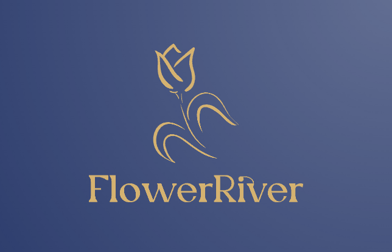
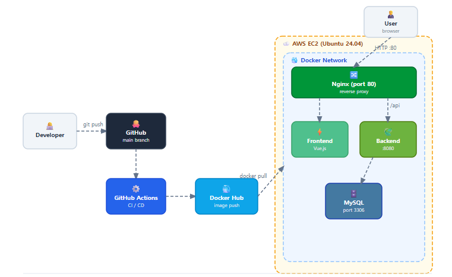
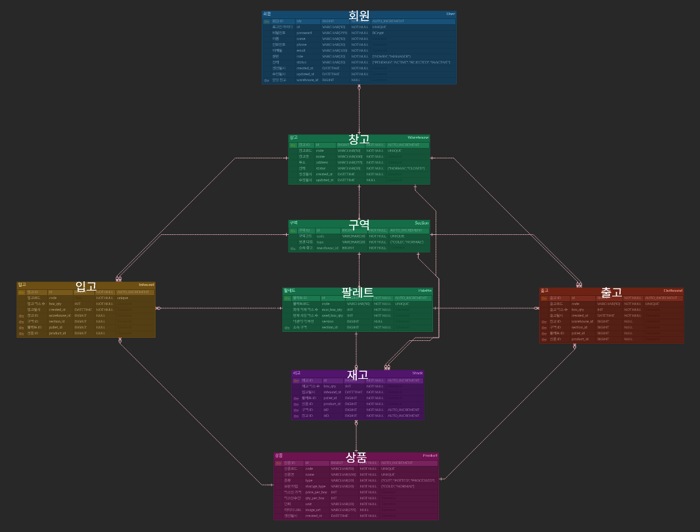
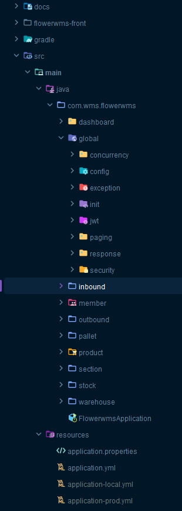

# 꽃가람(FlowerRiver)
> [서비스 링크](http://3.38.66.111)

## 프로젝트명 소개
- **꽃(Flower) + 가람(River : 江)**
- 꽃이 생산지에서 소비자에게 전달되기까지의 흐름과 유통 과정을 상징

## 프로젝트 소개 및 주제 선정 이유

꽃가람(FlowerWMS)은 화훼 유통업체를 위한 창고 관리 시스템입니다.
창고별 구역/팔레트 단위의 재고 관리, 입출고 이력 추적, 담당자 권한 관리 기능을 제공합니다.

이전 팀 프로젝트에서 Spring + MyBatis + JSP 기반으로 창고 파트를 담당한 경험을 바탕으로,
기술 스택을 Spring Boot + JPA + Vue.js로 전환하고 초기세팅부터 배포까지 전체 개발 사이클을 혼자 경험해보고자 시작한 프로젝트입니다.

## 프로젝트 기간

> [WBS](https://docs.google.com/spreadsheets/d/1q04lHp17hpnd0MchJRj8Go7Bk-VCiVae/edit?usp=sharing&ouid=117820360530029020758&rtpof=true&sd=true)

| 항목 | 내용 |
|------|------|
| 개발 기간 | 2026.02.24 ~ 2026.03.09 (2주) |
| 개발 인원 | 1인 (개인 프로젝트) |

## 로컬 실행

### 사전 요구사항
- Java 17
- MySQL 8
- Node.js 18+

### Backend
```bash
# application-local.yml 설정 후
./gradlew bootRun
```

### Frontend
```bash
cd flowerwms-front
npm install
npm run dev
```

## 개발 환경

### Backend


### Frontend


### Database


### Infra


### Version Control


## 시스템 아키텍처




## 브랜치 전략 및 컨벤션

### GitHub Flow

| 브랜치 | 설명 |
|--------|------|
| `main` | 배포 브랜치 (push 시 CI/CD 자동 실행) |
| `feature/*` | 기능 개발 브랜치 |
```
feature/warehouse → PR → main (자동 배포)
feature/member    → PR → main (자동 배포)
```

### 커밋 컨벤션

| 타입 | 설명 |
|------|------|
| `feat` | 새로운 기능 추가 |
| `fix` | 버그 수정 |
| `refactor` | 코드 리팩토링 |
| `chore` | 빌드/설정 변경 |
| `ci` | CI/CD 관련 |
| `test` | 테스트 코드 |


## 주요 기능

### 회원 관리
- 회원 가입 요청 / 총관리자 승인 및 창고 배정
- JWT 기반 인증 / ADMIN · MANAGER 역할 분리
- 내 정보 조회 · 수정 / 비밀번호 변경

### 창고 관리
- 창고 등록 / 목록 · 상세 조회 / 수정 / 폐쇄
- 창고 등록 시 구역(Section) · 팔레트(Pallet) 자동 생성
- 카카오맵 API 연동 (창고 위치 시각화)
- 창고 폐쇄 시 잔여 재고 체크 및 담당 관리자 자동 비활성화

### 입출고 관리
- 창고 · 구역 · 팔레트 단위 입고 등록 및 이력 조회
- FIFO(선입선출) 기반 자동 출고 처리
- 보관 타입(냉장/상온) 검증 로직

### 재고 관리
- 창고별 · 상품별 재고 현황 조회
- 입출고 기반 재고 변동 이력 조회

### 대시보드
- 전체 창고 · 재고 · 오늘의 입출고 요약 통계
- 창고별 사용량 · 상품별 재고 현황 차트
- 역할(ADMIN · MANAGER)별 화면 분리

## 📋 API 명세

> [Swagger UI](http://3.38.66.111/swagger-ui/index.html) | [API Excel](https://docs.google.com/spreadsheets/d/1yKoJoRnFobNhARaADYgSccdWfySPfkgFRguDhHQTLBs/edit?usp=sharing)

## 📊 ERD
> [ERDCloud](https://www.erdcloud.com/d/beyxDYcCChufZAEiM) |
[ERD Excel](https://docs.google.com/spreadsheets/d/1UXWe0mI-nLWYRVdn0BvdvfNkFDWYoL_h8kShQoyJAPA/edit?usp=sharing)



## 프로젝트 구조(CQRS 패턴 적용)
명령(Command)과 조회(Query)의 책임을 분리하여 설계했습니다.
- **Command** : 상태를 변경하는 작업(등록, 수정, 삭제)
- **Query** : 데이터를 조회하는 작업(목록, 상세)



## 시연 영상


## 트러블 슈팅
> - [동시성 제어 낙관적 락 적용](https://velog.io/@gyuliming/%ED%8A%B8%EB%9F%AC%EB%B8%94%EC%8A%88%ED%8C%85-%EB%8F%99%EC%8B%9C%EC%84%B1-%EC%A0%9C%EC%96%B4)
> - [JPA N+1 문제](https://velog.io/@gyuliming/%ED%8A%B8%EB%9F%AC%EB%B8%94%EC%8A%88%ED%8C%85-JPA-N1)


## 개선 목표

### 기술적 개선
- **테스트 코드 작성** : JUnit 기반 단위 테스트 및 통합 테스트 커버리지 확대
- **성능 개선** : 자주 조회되는 재고/대시보드 데이터에 Redis 캐싱 적용
- **QueryDSL 도입** : 동적 검색 조건이 많은 목록 조회에 QueryDSL로 리팩토링
- **HTTPS 적용** : Let's Encrypt를 활용한 SSL 인증서 적용 및 HTTPS 통신 환경 구성

### 기능 추가
- **아이디/비밀번호 찾기** : 이메일 인증 기반 계정 찾기 기능
- **알림 기능** : 재고 부족 및 입출고 발생 시 담당자 알림
- **권한 확장** : 회원사 단위까지 권한 범위를 확장하여 B2B WMS 구조로 발전


## 회고
2주라는 짧은 기간 안에 기획부터 배포까지 전체 사이클을 혼자 경험하면서 많은 것을 배웠습니다.

### 기술적으로 배운 점

- JPA / JPQL : MyBatis의 SQL 중심 사고에서 벗어나 객체 중심으로 설계하는 방식을 익혔습니다. 특히 N+1 문제를 직접 마주하고 JPQL 집계 쿼리로 해결하면서 JPA의 동작 방식을 깊이 이해를 높일 수 있었습니다.

- 동시성 제어 : 낙관적 락(@Version)과 재시도 로직을 직접 구현하고 멀티스레드 테스트로 검증하면서 동시성 문제를 처음으로 다뤄봤습니다.

- Spring Security + JWT : 인증/인가 흐름을 직접 구현하면서 필터 체인의 동작 방식과 역할 기반 접근 제어(RBAC)를 이해했습니다.

- CQRS 패턴 : Command와 Query를 분리하는 설계를 적용하면서 코드의 책임이 명확해지고 가독성이 높아진다는 것을 체감했습니다.

- CI/CD + Docker : GitHub Actions로 자동 빌드/배포 파이프라인을 구성하고 Docker 컨테이너로 서비스를 운영하면서 인프라 전반에 대한 이해도가 높아졌습니다.

### 개발 프로세스에서 배운 점

- 기획 → 설계 → 개발 → 배포 전체 흐름을 혼자 경험하면서 각 단계가 어떻게 연결되는지 이해할 수 있었습니다.

- 팀 프로젝트에서는 맡은 파트만 집중했지만, 이번에는 프론트엔드와 백엔드를 번갈아 개발하면서 두 영역이 어떻게 연동되는지 직접 느낄 수 있었습니다.